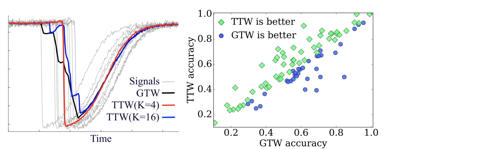

.. -*- mode: rst -*-

Trainable Time Warping (TTW)
============================

Matlab implementation of TTW, a time warping algorithm that estimates the DTW averaging solution in linear time and space complexity using a new deformable convolutional kernel, shifted sinc kernel.

What is this repository?
------------------------

This repository contains the MATLAB code of three dynamic time warping (DTW) averaging algorithms: generalized time warping (GTW) [1], trainable time warping (TTW) [2] and fast learnable time warping (FLTW) [2]. All these algorithms have linear time and space complexity with respect to the length and the number of input time-series. 

References
----------

.. [1] Feng Zhou and Fernando De la Torre,
       *“Generalized time warping for multi-modal alignment of human motion”*,
       CVPR, 2012. [`PDF <http://citeseerx.ist.psu.edu/viewdoc/download?doi=10.1.1.227.6175&rep=rep1&type=pdf>`_]

.. [2] Soheil Khorram, Melvin McInnis and Emily Mower Provost,
       *“Trainable Time Warping: Aligning Time-Series in the Continuous-Time Domain”*,
       ICASSP, 2019. [`PDF <https://arxiv.org/pdf/1903.09245.pdf>`_]

Author
------

- Soheil Khorram, 2019
